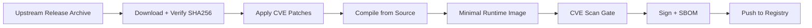

# FOSS Boilerplate

Managed fork of an open source project with security patches and controlled build pipeline.

## What This Does

- Downloads official upstream release archives (never git-clones upstream)
- Verifies checksums (SHA256 + optional GPG)
- Applies CVE security patches before compilation
- Builds minimal container images from approved base images
- Scans for vulnerabilities before every release
- Signs images and generates SBOM attestations

## Quick Start

```bash
# First-run setup
./init.sh

# Onboard a FOSS project (interactive)
make onboard

# Build from source (default)
make build

# Run security scans
make scan

# Full release pipeline
make release
```

## Build Strategies

| Strategy | Dockerfile | Use When |
|---|---|---|
| **Source** (priority) | `Dockerfile` / `Dockerfile.go` | Always — compile from archive with patches |
| **Binary** (fallback) | `Dockerfile.binary` | Source build blocked — requires tech lead approval |

## Architecture


